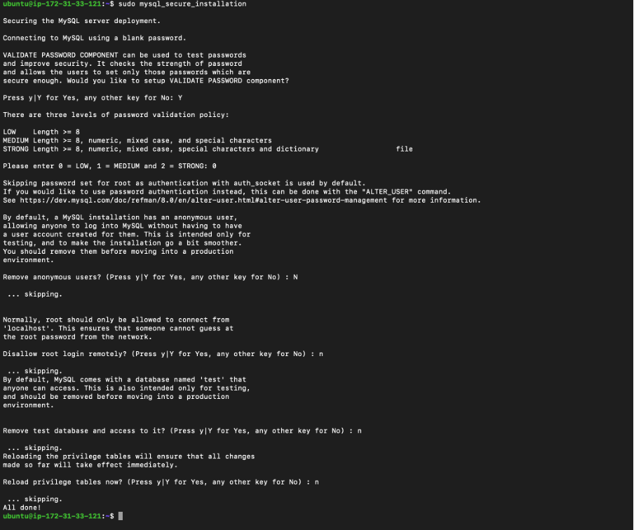
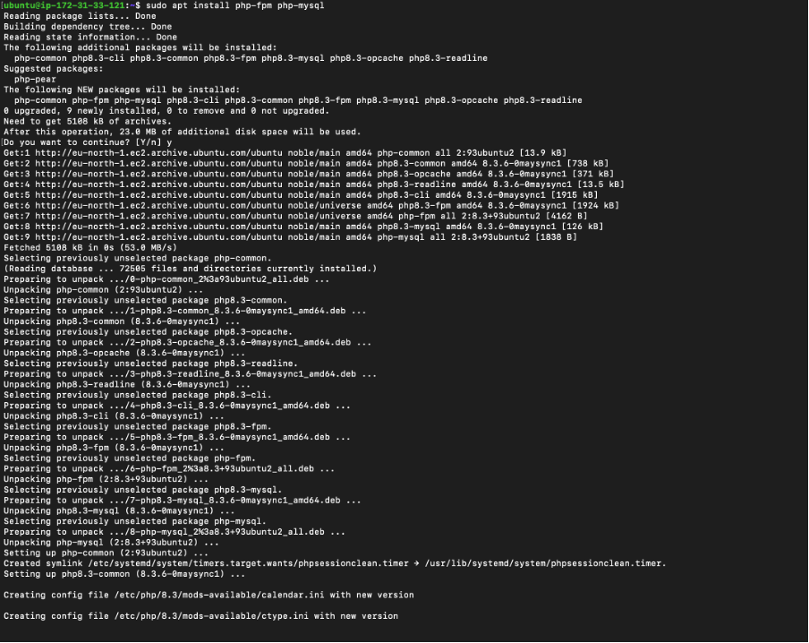
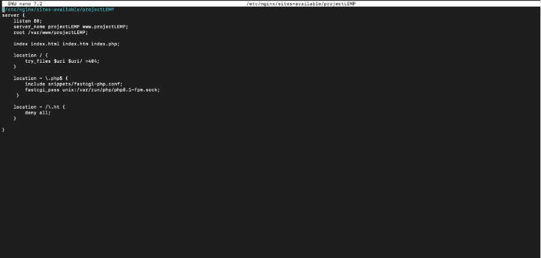

## WEB STACK IMPLEMENTATION (LEMP STACK) IN AWS

### Introduction:
__LEMP stack is a software stack used for web development, consisting of Linux (the operating system), Nginx (the web server), MySQL (or MariaDB, the database management system), and PHP (or sometimes Python or Perl, the programming language). It's similar to the LAMP stack, but replaces Apache with Nginx for better performance and scalability.__

## Step 1 - Install Nginx Web Server and Update the Firewall

__1.__ __Update and upgrade list of packages in package manager__
```
sudo apt update
sudo apt install nginx
```


__2.__ __Enable and verify that Nginx Web server is running on as a service on the OS.__
```
sudo systemctl enable nginx
sudo systemctl status nginx
```


__3.__ __The server is running and can be accessed locally in the ubuntu shell by running the command below:__

```
curl http://localhost:80
OR
curl http://127.0.0.1:80
```


**Test with the public IP address if the Apache HTTP server can respond to request from the internet using the url on a browser.**

```bash
http://16.171.195.22
```


__4.__ __Another way to retrieve the public ip address other than check the aws console__
```
curl -s http://169.254.169.254/latest/meta-data/public-ipv4
```


## Step 2 - Install MySQL

__1.__ __Install a relational database (RDB)__

MySQL was installed in this project. It is a popular relational database management system used within PHP environments.
```
sudo apt install mysql-server
```

When prompted, install was confirmed by typing y and then Enter.

__2.__ __when the installation is finished, log into the MySQL console by typing__

```
sudo mysql
```

This connects to the MySQL server as the administrative database user __root__ infered by the use of __sudo__ when running the command.

__3.__ __Set a password for root user using mysql_native_password as default authentication method.__

Here, the user's password was defined as "Admin123$"
```
ALTER USER 'root'@'localhost' IDENTIFIED WITH mysql_native_password BY 'Admin123$';
```

Exit the MySQL shell
```
exit
```
__4.__ __Run an Interactive script to secure MySQL__

The security script comes pre-installed with mysql. This script removes some insecure settings and lock down access to the database system.
```
sudo mysql_secure_installation
```

__5.__ __After changing root user password, log in to MySQL console.__

A command prompt for password was noticed after running the command below.
```
sudo mysql -p
```

Exit MySQL shell
```
exit
```

## Step 3 - Install PHP

__1.__ __Install php__
Nginx is installed to serve the content and MySQL is installed to store and manage data.
PHP is the component of the set up that processes code to display dynamic content to the end user.

```
sudo apt install php-fpm php-mysql
```


## Step 4 - Configuring Nginx to use PHP Processor

__1.__ __The default directory serving the nginx default page is /var/www/html. Create your document directory next to the default one.__

Created the root web directory for the domain using "mkdir" command
```
sudo mkdir /var/www/projectlEMP
```
__Assign the directory ownership with $USER environment variable which references the current system user.__
```
sudo chown -R $USER:$USER /var/www/projectlEMP
```


__2.__ __Create and open a new configuration file in Nginx’s “sites-available” directory using nano.__
```
sudo nano /etc/nginx/sites-available/projectlEMP
```

This will creat a new blank file. Past in the bare-bones configuration below:
```
# /etc/nginx/sites-available/projectLEMP
server {
    listen 80;
    server_name projectLEMP www.projectLEMP;
    root /var/www/projectLEMP;

    index index.html index.htm index.php;

    location / {
        try_files $uri $uri/ =404;
    }

    location ~ \.php$ {
        include snippets/fastcgi-php.conf;
        fastcgi_pass unix:/var/run/php/php7.4-fpm.sock;
     }

    location ~ /\.ht {
        deny all;
    }

}
```



__3.__ __To activate your configuration by liking to the config file from Nginx's sites-enabled directory__
```

```bash
sudo ln -s /etc/nginx/sites-available/your_domain /etc/nginx/sites-enabled/
```

__4.__  __Then, unlink the default configuration file from the /sites-enabled/ directory__

```bash
sudo unlink /etc/nginx/sites-enabled/default
```

This will tell Nginx to use the configuration next time it is reloaded.

__5.__ __You can test your configuration for syntax errors by typing__

```bash
sudo nginx -t
```
